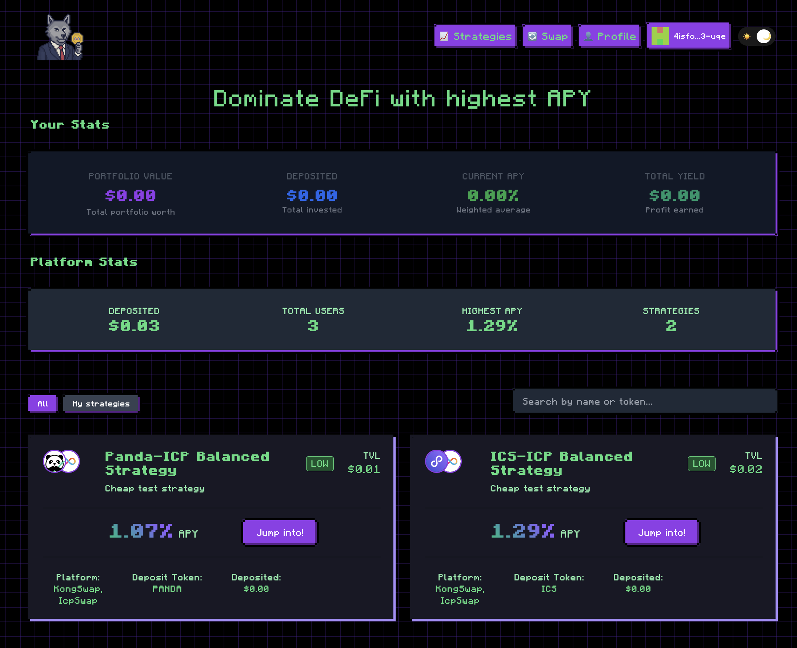
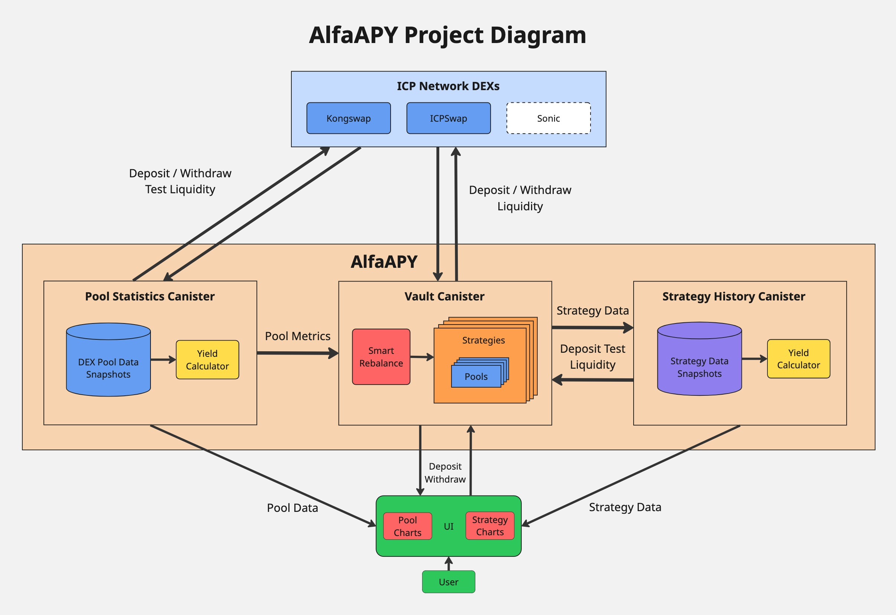

  
  
  

    

      🎯 <strong>New!</strong> Check out our comprehensive <a href="https://alfa-codes.github.io/alfa-apy-icp-canisters/" target="_blank" style="color: #22ff88; text-decoration: none; font-weight: 600;">technical documentation</a> with architecture details!
    

  

# ALFA APY

## 🚀 Advanced Yield Optimization DeFi Protocol on ICP

### Automatically maximize returns through intelligent liquidity management, real-time APY tracking, and dynamic asset rebalancing across multiple DEX providers.

## 🌟 [Live Application](https://5ac7m-miaaa-aaaah-qqfgq-cai.icp0.io/) | 📚 [Documentation](https://alfa-codes.github.io/alfa-apy-icp-canisters/)

## 🚀 Quick Links

- **🎯 [Live Application](https://5ac7m-miaaa-aaaah-qqfgq-cai.icp0.io/)** - Try ALFA APY now
- **📖 [Technical Documentation](https://alfa-codes.github.io/alfa-apy-icp-canisters/)** - Complete architecture and API reference
- **🎥 [Introduction Video](https://youtu.be/ldqRNLbQflI)** - Learn about ALFA APY
- **📈 [Progress Update](https://www.youtube.com/watch?v=Vb0YfFJg770)** - Latest development status

---

## What is ALFA APY?

ALFA APY is an advanced on-chain liquidity manager built on the Internet Computer Protocol (ICP). Users invest into distinct strategy types (e.g. Conservative, Balanced, Aggressive) with automated rebalancing policies that dynamically allocate capital to the highest-yielding liquidity pools across multiple DEX providers.

### User Interface

    

### Key Features

- **🚀 Smart Rebalance Algorithm** - Proprietary scoring system with composite metrics (APY, TVL, volatility, execution costs)
- **💎 Multi-Strategy Support** - Conservative, Balanced, Aggressive, etc, profiles with customizable risk parameters
- **🌊 Multi-Provider Integration** - KongSwap, ICPSwap with unified abstraction layer
- **⚡ Real-Time Performance** - On-chain snapshots and realized APY calculations
- **📊 Comprehensive Analytics** - Strategy history, pool metrics, and performance tracking
- **🔒 Non-custodial & Auditable** - Full event logging and structured error handling

### Project Diagram

  

## Technology Stack

- **Backend**: Rust + Internet Computer Protocol (ICP)
- **Frontend**: TypeScript + React + Vite
- **Blockchain**: ICP with ICRC-1/ICRC-2 token standards
- **DEX Integration**: KongSwap, ICPSwap via provider abstraction
- **Architecture**: Modular canister design (Vault, PoolStats, StrategyHistory)

## 🏗️ Architecture Overview

### Core Canisters
- **Vault**: Strategy management, deposits/withdrawals, SmartRebalance execution
- **PoolStats**: Real-time pool metrics, APY calculations, position snapshots
- **StrategyHistory**: Longitudinal strategy analysis and performance tracking

### Smart Rebalance Engine
Advanced algorithm that evaluates pools using:
- Short-term APY smoothing (SMA)
- Pool size and capital efficiency metrics
- APY and token price volatility analysis
- Explicit execution cost calculations
- Strategy-specific safety gates and cooldowns

## 🚀 Roadmap & Open Items

### 🎯 Planned Features
- [ ] **AI factor for Smart Rebalance** - Machine learning integration for enhanced decision making
- [ ] **Index-based strategies** - Portfolio strategies based on market indices
- [ ] **Customizable strategies** - User-configured strategy parameters and risk profiles
- [ ] **Retry mechanism** - Automatic retry for failed deposit/withdrawal operations

### ✅ Completed Features
- [x] **SmartRebalance Algorithm** - Advanced scoring and rebalancing engine
- [x] **Integration tests and mocks** - Comprehensive testing infrastructure
- [x] **UI events grouping** - Enhanced user interface event management
- [x] **Multi-wallet support** - Support for all ICP wallets
- [x] **Strategy charts** - Visual performance analytics
- [x] **Strategy history** - Complete transaction and performance tracking

## 🚀 Getting Started

  <h3 style="margin: 0 0 15px 0; color: #0f0f0f; font-size: 24px; font-weight: 700;">Ready to Build with ALFA APY?</h3>
  

    Get started with our comprehensive technical documentation and guides
  

  <a href="https://alfa-codes.github.io/alfa-apy-icp-canisters/" target="_blank" style="display: inline-block; background: #0f0f0f; color: #22ff88; padding: 12px 24px; border-radius: 8px; text-decoration: none; font-weight: 600; font-size: 16px; transition: all 0.3s ease; border: 2px solid #0f0f0f;">
    📖 View Technical Documentation
  </a>

**Documentation Sections:**
- **🏗️ [Architecture](./docs/main_doc_draft.md#2-architecture)** - Canister design and cross-canister interactions
- **🧠 [Smart Rebalance](./docs/smart_rebalance.md)** - Algorithm details and scoring formulas
- **📊 [User Interface](./docs/user_interface.md)** - UI flows and user experience
- **🔧 [Error Handling](./docs/error_codes.md)** - Structured error codes and debugging
- **📈 [Liquidity Management](./docs/liquidity_pools_calculation_flow.md)** - Pool operations and calculations

## Source Code

- **Backend**: [https://github.com/alfa-codes/alfa-apy-icp-canisters](https://github.com/alfa-codes/alfa-apy-icp-canisters)
- **Frontend**: [https://github.com/alfa-codes/alfa-apy-frontend](https://github.com/alfa-codes/alfa-apy-frontend)

## Community & Support

- **Website**: [https://5ac7m-miaaa-aaaah-qqfgq-cai.icp0.io/](https://5ac7m-miaaa-aaaah-qqfgq-cai.icp0.io/)
- **Internet Computer**: [https://internetcomputer.org](https://internetcomputer.org)
- **DFINITY Foundation**: [https://dfinity.org](https://dfinity.org)
