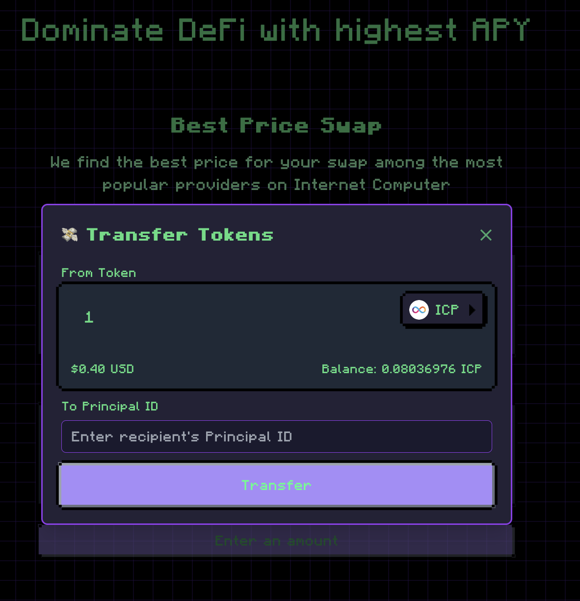

# User Interface

This document provides a comprehensive overview of the AlfaAPY user interface, showing how users interact with the platform to manage their DeFi strategies.

## Core Strategy Management

### Strategies Overview

The main strategies overview page displays all available investment strategies with their current performance metrics. Users can see APY, TVL, and strategy status at a glance.

    

### Strategy Details

Individual strategy detail view showing comprehensive information about a specific strategy including current pool allocation, historical performance charts, and strategy-specific metrics.

    

### Deposit Flow

The deposit flow guides users through adding funds to a strategy:

**Step 1: Initialization**
- Select strategy type and enter deposit amount
- Review strategy details and current performance

    

**Step 2: Processing**
- Confirm transaction details and fees
- Approve token spending allowance

    

**Step 3: Completion**
- Receive strategy shares proportional to deposit
- View updated portfolio allocation

    

### Withdrawal Flow

The withdrawal process allows users to exit strategies and redeem their shares:

**Step 1: Initialization**
- Select strategy and specify withdrawal amount
- Review current strategy performance and shares

    

**Step 2: Processing**
- Confirm withdrawal details and calculate fees
- Process liquidity removal from pool

    

**Step 3: Completion**
- Successfully withdraw tokens and update shares
- View transaction confirmation and updated balance

    

### Event Tracking

Every action in the system is logged with detailed event records. Users can track the complete lifecycle of their operations and view detailed information for each event:

**Event Logging System:**
- All user actions generate event records with timestamps
- Each event includes correlation IDs to link related operations
- Events show operation status: Started, Completed, or Failed

    

**Event Details:**
- Transaction timestamps and status
- Error details and failure reasons
- Pool and strategy information
- Token amounts and addresses involved

    

## User Account & Tools

### User Profile Dashboard

User dashboard showing personal investment overview, portfolio performance, transaction history, and account settings. Users can track their strategy allocations and overall returns.

    

### Token Swaps

Token exchange functionality allowing users to swap between different tokens:

**Step 1: Swap Initialization**
- Select input and output tokens
- Enter amount to swap
- Review current exchange rates

    

**Step 2: Swap Execution**
- Confirm swap details and fees
- Execute the token exchange
- View successful swap confirmation

    

### Transfer Tokens

Direct token transfer functionality allowing users to send tokens to other addresses:
- **Transfer Interface**: Select recipient and amount
- **Confirmation**: Review transfer details and gas fees
- **Execution**: Complete transfer transaction

    

